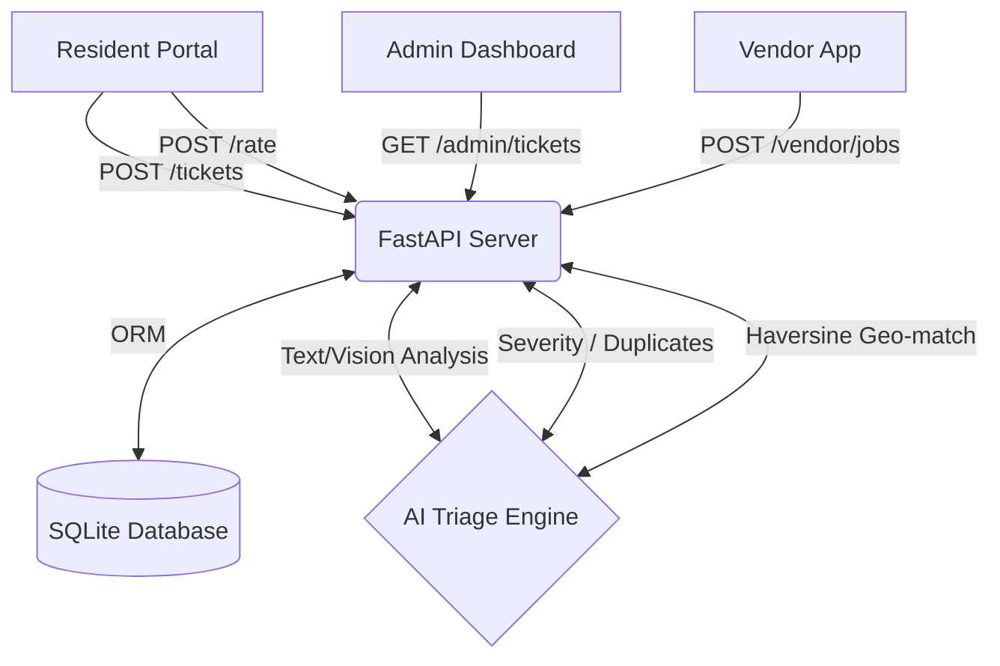

<div align="center">
  
  <h1 align="center">FixNest</h1>
  <p align="center">
    <strong>AI-Powered Facility Resolution Platform for Gated Communities</strong>
  </p>
  <p align="center">
    <a href="#features">Features</a> •
    <a href="#tech-stack">Tech Stack</a> •
    <a href="#getting-started">Getting Started</a> •
    <a href="#architecture">Architecture</a>
  </p>
</div>

<br>

FixNest is an innovative, AI-driven facility management platform designed specifically for gated communities. It streamlines maintenance requests by bridging the gap between Residents, Community Admins, and Service Vendors.

By leveraging local AI for ticket triage and geographic validation, FixNest ensures rapid resolution and absolute transparency.

---

## 🌟 Features

### For Residents
- **Modern Dashboard:** Track your maintenance requests via an intuitive timeline (Submitted -> In Progress -> Completed -> Feedback).
- **Instant Reporting:** Raise tickets for unit-specific or common-area issues.
- **Rating & Auto-Reopen:** Complete the feedback loop with a star rating. Tickets rated 2-stars or below are automatically reopened and escalated for manual admin review.

### For Facility Admins
- **AI Ticket Queue:** Incoming tickets are automatically analyzed and categorized by AI, predicting severity and identifying potential duplicates.
- **Vendor Management & Dispatch:** Seamlessly route approved jobs to local vendors via automated smart dispatching.
- **B2B Analytics:** Comprehensive analytics dashboard tracking service-level agreements (SLAs), platform usage, vendor ratings, and cost trends.

### For Service Vendors
- **Job Acceptance:** Vendors receive real-time job offers on their dedicated portal.
- **Geo-Tag Verification:** Upon completing a job, vendors submit a photo that acts as proof of work. FixNest uses the Haversine formula to verify if the vendor's GPS coordinates match the originally reported issue location within a 50m radius.

---

## 🛠 Tech Stack

**Frontend:**
- [Next.js 16](https://nextjs.org/) (App Router)
- [React](https://reactjs.org/) & [TypeScript](https://www.typescriptlang.org/)
- [Tailwind CSS](https://tailwindcss.com/) for beautiful, utility-first styling
- [Phosphor Icons](https://phosphoricons.com/)

**Backend:**
- [FastAPI](https://fastapi.tiangolo.com/) (High-performance Python web framework)
- [SQLAlchemy](https://www.sqlalchemy.org/) & [SQLite](https://sqlite.org/) (Relational DB mapping & persistence)
- `transformers` & `sentence-transformers` (Local AI models for text/image analysis)

---

## 🚀 Getting Started

Follow these steps to run FixNest on your local machine.

### Prerequisites
- Node.js (v18+)
- Python (3.11+)

### Cloning the Repository
To run this project on another machine, first clone the repository and navigate into it:
```bash
git clone <your-repository-url>
cd fixnest
```

### 1. Backend Setup

Open a terminal and navigate to the backend directory:

```bash
cd backend

# Create a virtual environment
python -m venv venv

# Activate the virtual environment
# Windows:
.\venv\Scripts\activate
# macOS/Linux:
source venv/bin/activate

# Install dependencies (includes scikit-learn, sentence-transformers, kagglehub, FastAPI)
pip install -r requirements.txt

### 1a. AI Model Training & Initialization
FixNest uses a locally trained AI model for genuineness classification and keyword taxonomy mapping. Before starting the server, you need to train the model.

Ensure you are in the `backend` directory with the virtual environment activated, then run the training script:
```bash
# This will auto-download datasets from Kaggle and train the Logistic Regression model
python ../scripts/train_genuineness_model.py
```
*Note: This script will download three datasets (NYC 311, SMS Spam, Fake Job Postings) via `kagglehub`, train the model, and save `genuineness_model.joblib` and `keyword_taxonomy.json` into `backend/models/`. First-time execution may take a few minutes as it downloads HuggingFace models for SentenceTransformers and CLIP.*

### 1b. Database Setup & Running the Server

```bash
# Seed the local SQLite database with mock users, vendors, and tickets
python seed.py

# Run the API server
uvicorn main:app --reload
```
The backend API will run on `http://127.0.0.1:8000`.

### 2. Frontend Setup

Open a new terminal and navigate to the frontend directory:

```bash
cd frontend

# Install dependencies
npm install

# Start the development server
npm run dev
```
The frontend will run on `http://localhost:3000`.

---

## 🔒 Demo Authentication

When accessing the frontend (`http://localhost:3000`), you can use the following mock credentials to explore the different portals:

| Role | Email | Password |
| :--- | :--- | :--- |
| **Admin** | `admin123@society.in` | `admin@123` |
| **Resident** | (Use quick-login button) | (Use quick-login button) |
| **Vendor** | (Use quick-login button) | (Use quick-login button) |

---

## 📁 .gitignore Configuration

A comprehensive root `.gitignore` file has been added to ensure clean commits when sharing the project across machines. It specifically ignores:
- `node_modules/` and `.next/` (Frontend build & dependencies)
- `venv/` and `__pycache__/` (Backend virtual environments & compiled Python)
- `*.sqlite` / `*.db` (Local database files)
- `.env` files (Local environment variables)

This ensures only the source code is pushed to version control, making it easy for other developers to clone and install dependencies cleanly.

---

## 📐 Architecture Overview



---

<div align="center">
  Built with ❤️ for better community living.
</div>
